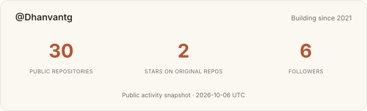
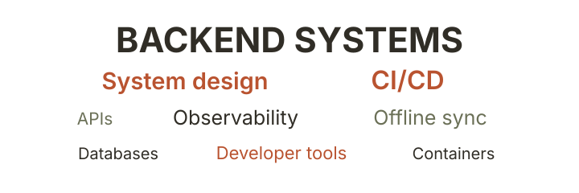

<div align="center">

# *Hi, I'm Dhanvant*

**Backend engineering · System design · CI/CD**

I like understanding what happens behind the interface—how data moves,
how systems recover, and how software gets from a commit to a running service.



### <sup>LET’S CONNECT</sup>

[](https://www.linkedin.com/in/dhanvant-gajapathy-b149981b3/)
[](mailto:dhanvantg@gmail.com)
[](https://github.com/Dhanvantg)

<br>

---

### <ins><sup>WHAT I BUILD</sup></ins>



### <ins><sup>MY TOOLBOX</sup></ins>

<sup>LANGUAGES & EVERYDAY TOOLS</sup>


<details>
<summary><ins><sup>MORE OF THE STACK</sup></ins></summary>

<br>

<sup>BACKENDS & APIs</sup>


<sup>DATA & OPERATIONS</sup>


<sup>INTERFACES & AI TOOLS</sup>


</details>

<br>

---

### <ins><sup>A FEW THINGS I’VE WORKED ON</sup></ins>

</div>

| Work | What interests me about it |
| :--- | :--- |
| **SSMS** · team codebase | Offline ordering, a shared backend, and replaying writes safely when devices reconnect. |
| **GPLAN** · team codebase | Long-running geometry jobs and an MCP interface that returns compact task references. |
| **[Daemon Manager](https://github.com/Dhanvantg/Daemon-Manager)** | A Go service for inspecting and managing systemd services through constrained operator actions. |
| **[Sketchy Place](https://github.com/Dhanvantg/Sketchy-Place)** | A personal scrapbook with independent integration workers, a SQLite cache, live updates, and CI checks. |

<div align="center">

<br>

### <ins><sup>UNIVERSITY & COMMITMENTS</sup></ins>

**BITS Pilani · 2024–2029**<br>
M.Sc. Mathematics + B.E. Computer Science

Backend developer at **Students’ Union Technical Team** and **BITS Pilani x Postman Innovation Lab**.

</div>

<details>
<summary><ins><sup>CLUBS, TEACHING & INTERNSHIPS</sup></ins></summary>

<br>

| Commitment | Role | Dates |
| :--- | :--- | :--- |
| Students’ Union Technical Team, BITS Pilani | Backend Developer | Jan 2025–Present |
| BITS Pilani x Postman Innovation Lab | Backend Developer | Apr 2025–Present |
| Pilani Tamil Mandram | Event Coordinator | Aug 2024–Present |
| Google Developer Groups on Campus, BITS Pilani | Member · competitive programming | Feb 2025–Present |
| Coding Club BITS Pilani | Backend Developer | Jan 2025–Jun 2026 |
| BITS Pilani Digital | Teaching Assistant · Foundations of Data Science and Engineering | May 2026–Present |
| BITS Pilani Library | Teaching Assistant | Aug 2025–Present |
| I-NET SECURE LABS PRIVATE LIMITED | Backend Intern | Apr 2026–Jul 2026 |
| SmartQnA | Backend Developer Intern | Apr 2025–Jul 2025 |

</details>

<div align="center">

<br>

---

### <ins><sup>A LITTLE GITHUB CONTEXT</sup></ins>

<!--START_SECTION:github-context-->
**Public repositories by primary language**

```text
Python         20 repos  ██████████████░░░░░░   71.4%
HTML            4 repos  ███░░░░░░░░░░░░░░░░░   14.3%
Go              2 repos  █░░░░░░░░░░░░░░░░░░░    7.1%
C               1 repos  █░░░░░░░░░░░░░░░░░░░    3.6%
PHP             1 repos  █░░░░░░░░░░░░░░░░░░░    3.6%
```

<sub>Owned, non-fork public repositories with a detected primary language. Private and organization work is not included.</sub>

<sub>On GitHub since 2021 · Updated 2026-10-05 UTC</sub>
<!--END_SECTION:github-context-->

<br>

*Away from the code: a few miles, some music, and the occasional detour.*

</div>
